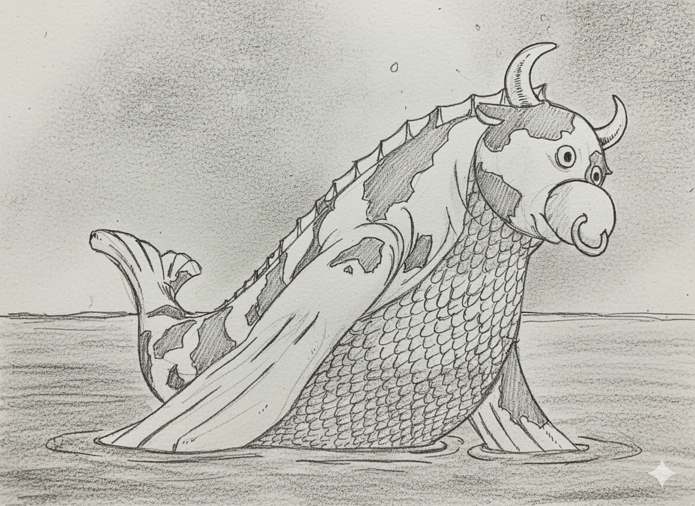
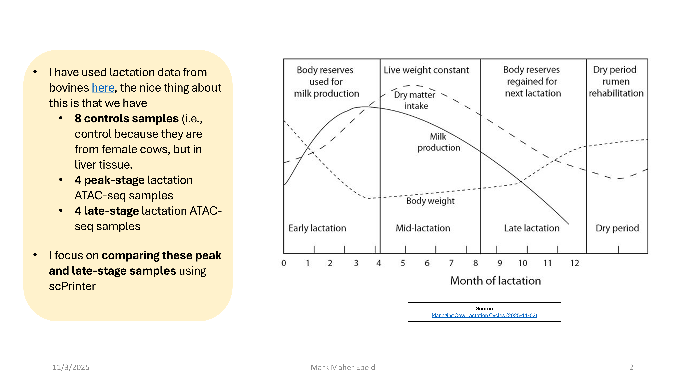
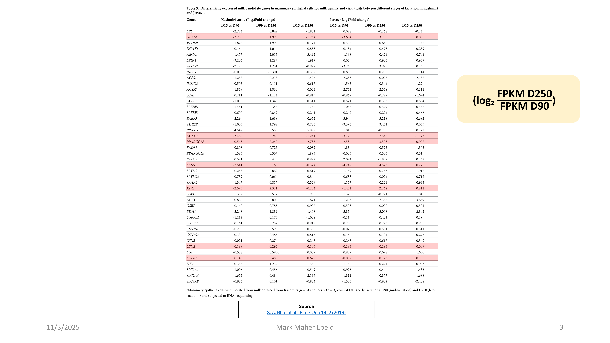
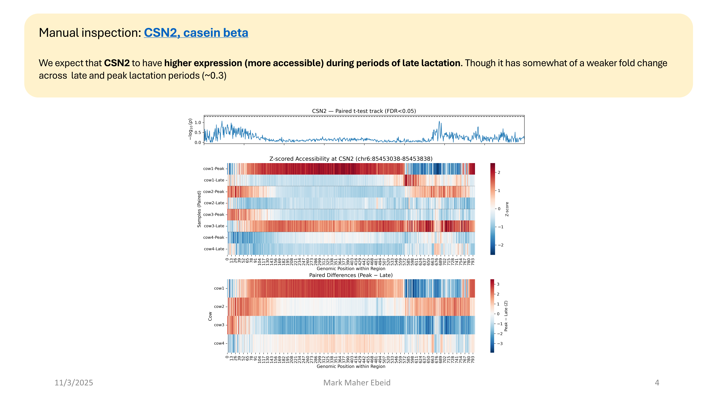
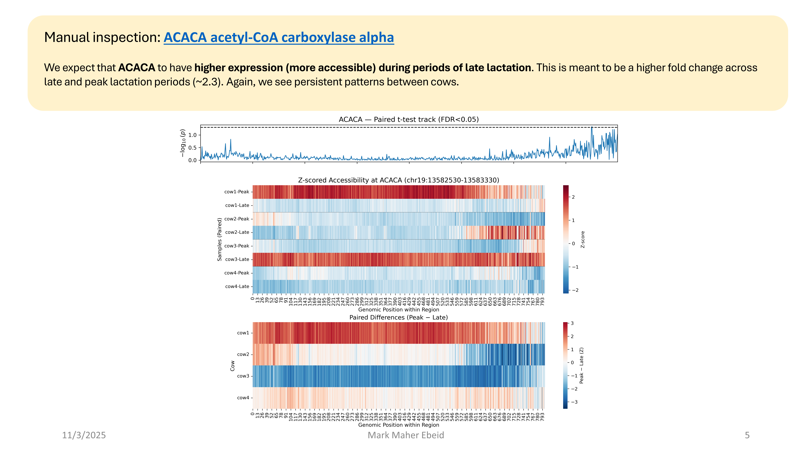
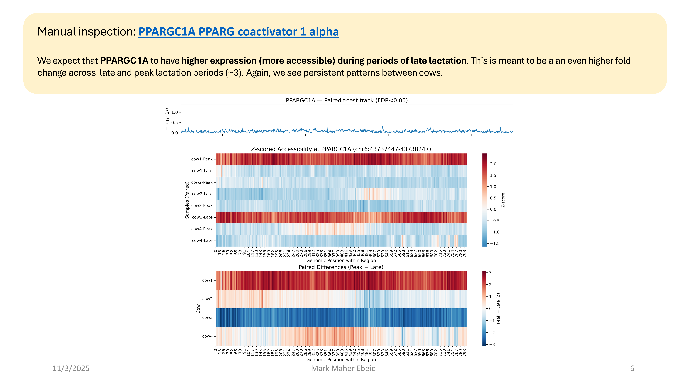
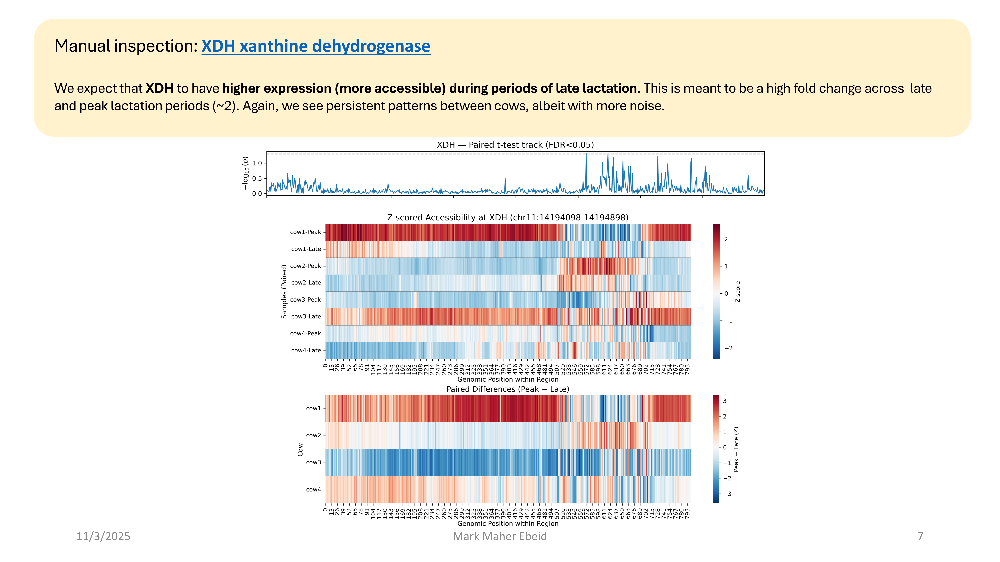

    

# Differential expression between peak and late stage lactation

Should be fun...I think it is an interesting question. People talk about how different contexts alter gene expression all the time, and naturally this extends to time as well. Although there is no explicit time component to this analysis, we have ATAC profiles from peak lacation and late lacation in cows from their mammary glands.

## Dataset

We use publicly available data to do this, find it [here](https://www.ncbi.nlm.nih.gov/sra?term=((bovine)%20AND%20lactation)%20AND%20atac)

## Method

We use [scPrinter](https://github.com/buenrostrolab/scPrinter/tree/main); this is primarily so I can really do through the whole pipeline with it because I am curious.

## Some of my findings...

> Rendered slide images exported from PowerPoint

### CSN2

### ACACA

### PPARGC1A

### XDH

